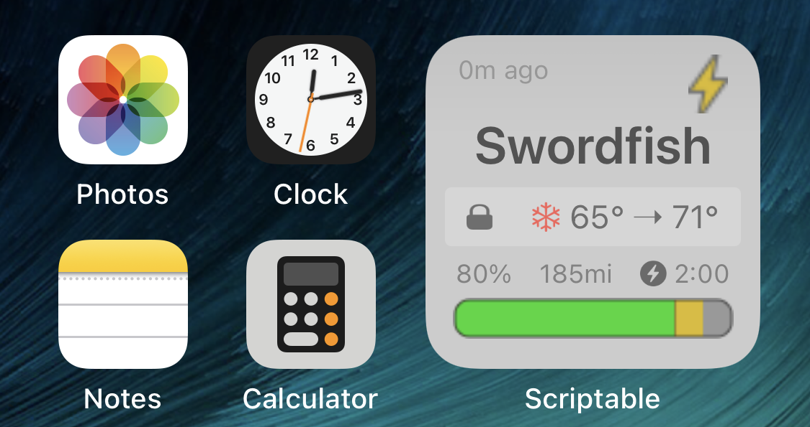

# TeslaData Widget
A Scriptable widget to pull data from a given API, eg. TeslaFi, Teslalogger, Tronity to display a widget on your iPhone. 

 &nbsp; 

## Usage
### New Install

* Get Scriptable in the Apple App Store.
* Download the `TeslaData Widget.js` file to your iCloud/Scriptable folder (or create a new widget in the scriptable app).
* Create a small scriptable widget.
* Under widget options, select "TeslaData Widget" and enter the API url into the widget parameters.

### Updates

* Replace the `TeslaData Widget.js` in your iCloud/Scriptable folder with the one here.
* Wait 5-7 minutes for Scriptable to grab the new file and update the widget.

### Optional
* Download the tesla_themes directory to your iCloud/Scriptable folder.
* Edit the widget variable "custom_theme" to include the name of the theme you want to load (e.g. custom_theme = "3d" will load the 3d.js theme from the themes directory).

### TeslaFi API
You obviously need a TeslaFi account (and a Tesla). Get your [API Key](https://teslafi.com/api.php).

API url: `https://www.teslafi.com/feed.php?token=YOUR_API_KEY&command=lastGood&encode=1`

### Other API
If you use other tools like [TeslaLogger](https://github.com/bassmaster187/TeslaLogger), [Tronity](https://tronity.io/home/5OiA7SfA), etc. you only have to provide [json file](documentation/sample.json) with the following data ([more details on the required fields](documentation/json_requirements.md)):

`
{
   "response":null,
   "battery_level":27,
   "usable_battery_level":26,
   "charge_limit_soc":90,
   "carState":"Idling",
   "Date":"2020-10-28T14:57:15Z",
   "sentry_mode":0,
   "display_name":"Name",
   "locked":1,
   "is_climate_on":0,
   "inside_temp":14.6,
   "driver_temp_setting":22.0,
   "measure":"km",
   "est_battery_range":90.605842,
   "battery_range":125.2227454,
   "time_to_full_charge":0.0,
   "fast_charger_type":"<invalid>"
}
`

API url (eg.): https://MY_USER:MY_PASS@MY_URL.com/api.json

## Configuration

There are a few options if you want to turn on/off battery percentage and estimated range (and if you'd like to use the car's range, or the TeslaFi estimate). These options are the constants at the top of the file (set the variables as true/false)

There's also an option for a 3D styled battery bar.

Note, due to the lag with TeslaFi pulling data from your car, and the lag of iOS pulling the data, the resulting display could be ~5 minutes stale (and the data could be hours or even a day old because TeslaFi lets the car sleep, so its not sending data)

Also note that this really only works as a small widget size, and only tested on an iPhone X (it may work fine for other phones, but not sure about iPad)

## Features

This should support:
* charging overview (current charge, charge limit, and time until charge complete)
* conditioning on indicator
* doors locked/unlocked
* interior temperature
* sentry mode on
* sleeping, idle, driving indicator
* time since the data was retreived from the car (respects TeslaFi sleep)

## Outstanding Bugs

- There appears to be an issue with SF graphics in Scriptable where the images are stretched.
- Dark mode doesn't currently work for widgets in Scriptable.

## Notes for Developers

Starting with v1.5 TeslaData now supports theming. The theme file is loaded right before the widget is drawn and displayed, so the theme can override any existing code (so you can change how things work without worrying about your code being overwritten with future updates of Tesla Data).

Note: due to the way themes are includes, debugging information from Scriptable is lacking. For testing purposes, it is probably best to develop by adding code to the end of the main Javascript file, and moving the code to a theme file once the code is running properly.

Starting with v1.5 The all colors are defined as an obect at the top of the file. These can be overriden if you want to make changes (you should use a theme file for this).

Starting with v1.5 TeslaData will optionally pull JSON files from iCloud for testing purposes. Place your JSON files in the tesla_themes directory on iCloud, and tell the widget to pull the data by modifying the debug_data string (i.e. debug_data = "standard" will load the "standard.json" file and ignore the URL).

## Changelog

- v1.5 
   - Complete rewrite of the code for cleanliness.
   - Many fields are no longer required (but still preferred)
   - Added code to store a copy of the last data, so the widget doesn't error when the device doesn't have network
   - Added support for themes (and moved 3d bars into a theme)
- v1.0 
   - Use apiurl parameter instead apikey (now supports any JSON source)
   - Renamed to TeslaData widget.
   - Fixed issue where disance value wasn't correct for metric.
- v0.8 
   - Added color coded snowflake to show if we're heating or cooling.
   - Added target temperature to display when preheating/cooling.
   - Added charging icon to show when the charger is connected (but not currently charging).
   - Added metric range display (untested).
   - Added internal temperature showing faded when the data is more than 2 hours old (since the internal temp is probably invalid).
   - Added usable vs. total charge (for colder weather).
- v0.7 
   - Added custom bolt icon for charging so I could add a stroke, changed charging color.
   - Adjusted 3D styling
   - Added time since last communication with the car.  
- v0.6 
   - Initial release added to GitHub  
