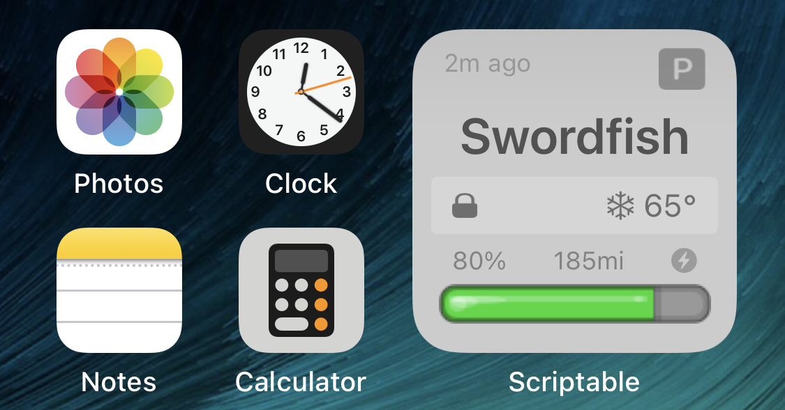

# TeslaFi-Widget
A Scriptable widget to pull data from the TeslaFi API

 &nbsp; 

## Usage
You obviously need a TeslaFi account (and a Tesla). Get your [API Key](https://teslafi.com/api.php).

* Download Scriptable to your iOS device
* Download the TeslaFi Widget.js file to you iCloud/scriptables folder
* Create a small scriptable widget
* Under widget options, select "TeslaFi Widget" and enter the API key into the widget parameters

There are a few options if you want to turn on/off battery percentage and estimated range (and if you'd like to use the car's range, or the TeslaFi estimate). These options are the constants at the top of the file (set the variables as true/false)

There's also an option for a 3D styled battery bar.

Note, due to the lag with TeslaFi pulling data from your car, and the lag of iOS pulling the data, the resulting display could be ~5 minutes stale (and the data could be hours or even a day old because TeslaFi lets the car sleep, so its not sending data)

Also note that this really only works as a small widget size, and only tested on an iPhone X (it may work fine for other phones, but not sure about iPad)

## Features

This should support:
* charging overview (current charge, charge limit, and time until charge complete)
* conditioning on indicator
* doors locked/unlocked
* interior temperature
* sentry mode on
* sleeping, idle, driving indicator
* time since TeslaFi retreived data from the car (respects sleep)

## Outstanding Bugs

There appears to be an issue with SF graphics in Scriptable where the images are stretched. 

## Changelog

v0.6 initial release added to GitHub  
v0.7 added custom bolt icon for charging so I could add a stroke, changed charging color. Adjusted 3D styling, added time since last communication with the car.  
v0.8 added color coded snowflake to show if we're heating or cooling. Added target temperature to display when preheating/cooling. Added charging icon to show when the charger is connected (but not currently charging). Added metric range display (untested). Added internal temperature showing faded when the data is more than 2 hours old (since the internal temp is probably invalid).

