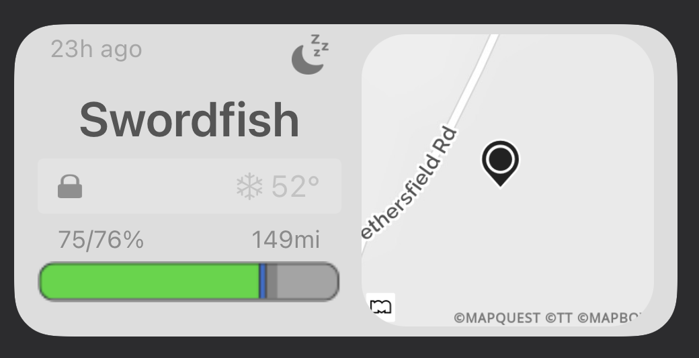
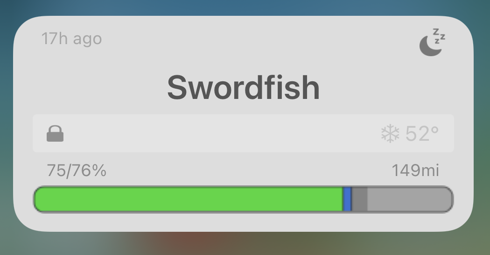
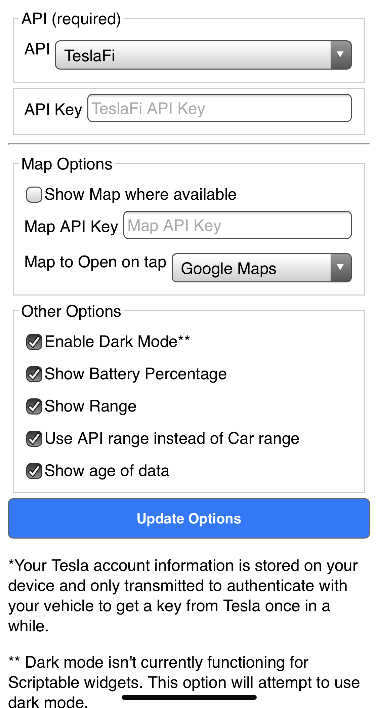

# TeslaData Widget
A Scriptable widget to pull data from a given API, eg. TeslaFi, Teslalogger, Tronity to display a widget on your iPhone. 

 &nbsp;  &nbsp; 

## Usage
### Install with Scriptdude

### Manual Install

* Get Scriptable in the Apple App Store.
* Download the `TeslaData Widget.js` file to your iCloud/Scriptable folder (or create a new widget in the scriptable app).

## Setup

* Click on TeslaData within the Scriptable App and step through the confguration.
* Create a Scriptable widget.
* Long press on the widget, choose "Edit Widget"
* Choose "TeslaData" from the Script Menu

### Optional/Advanced
* Get a [map API key from MapQuest](https://developer.mapquest.com/) and add it to your parameters.js file.
* Install any themes into the tesla_data folder, and modify the parameters.js file to include the theme you'd like to apply (e.g. custom_theme = "3d" will load the 3d.js theme from the themes directory).
* If you have multiple cars, you can put your TeslaFi key or other datalogger URL into the script parameters. All other options will be the same across widgets.

### TeslaFi API
You obviously need a TeslaFi account (and a Tesla). Get your [API Key](https://teslafi.com/api.php).

Note, due to the lag with TeslaFi pulling data from your car, and the lag of iOS pulling the data, the resulting display could be ~5 minutes stale (and the data could be hours or even a day old because TeslaFi lets the car sleep, so its not sending data)

### Other API
If you use other tools like [TeslaLogger](https://github.com/bassmaster187/TeslaLogger), [Tronity](https://tronity.io/home/5OiA7SfA), etc. you only have to provide [json file](documentation/sample.json) with the following data ([more details on the required fields](documentation/json_requirements.md)):

`
{
   "response":null,
   "battery_level":27,
   "usable_battery_level":26,
   "charge_limit_soc":90,
   "carState":"Idling",
   "Date":"2020-10-28T14:57:15Z",
   "sentry_mode":0,
   "display_name":"Name",
   "locked":1,
   "is_climate_on":0,
   "inside_temp":14.6,
   "driver_temp_setting":22.0,
   "measure":"km",
   "est_battery_range":90.605842,
   "battery_range":125.2227454,
   "time_to_full_charge":0.0,
   "fast_charger_type":"<invalid>"
}
`

API url (eg.): https://MY_USER:MY_PASS@MY_URL.com/api.json

## Map

At medium sizes, the widget will show a map with the location of the car, but only if your API includes long/lat. We would recommend getting your own API key and putting it in the configuration to reduce load on our systems. Visit https://developer.mapquest.com/ to create an account and get an API. 

## Configuration

If you run TeslaData from the Scriptable app, the configuration screen will display, where you'll be able to configure TeslaData.

 &nbsp;

At the bottom of the configuration screen, you'll find buttons for debug display of the small, medium, and large size widgets. This is used to preview the widget for development use, but you can also use it to preview the changes you've made to the configuration. Note that you need to update your configuration before previewing changes.

## Features

This should support:
* charging overview (current charge, charge limit, and time until charge complete)
* conditioning on indicator
* doors locked/unlocked
* interior temperature
* sentry mode on
* sleeping, idle, driving indicator
* time since the data was retreived from the car (respects TeslaFi sleep)
* map location of the car's current position

## Themes

To add themes to TeslaData you need to add theme files to the tesla_data file, and modify the custom_theme variable at the top of the widget code. To get an overview of themes, you can look at the [Theme Listing](documentation/theme_listing.md) page.

## Outstanding Bugs

- There appears to be an issue with SF graphics in Scriptable where the images are stretched.
- Dark mode doesn't currently work for widgets in Scriptable.

## Notes for Developers

Starting with v1.5 TeslaData now supports theming. The theme file is loaded right before the widget is drawn and displayed, so the theme can override any existing code (so you can change how things work without worrying about your code being overwritten with future updates of Tesla Data).

Note: due to the way themes are includes, debugging information from Scriptable is lacking. For testing purposes, it is probably best to develop by adding code to the end of the main Javascript file, and moving the code to a theme file once the code is running properly.

Starting with v1.5 The all colors are defined as an obect at the top of the file. These can be overriden if you want to make changes (you should use a theme file for this).

Starting with v1.5 TeslaData will optionally pull JSON files from iCloud for testing purposes. Place your JSON files in the tesla_themes directory on iCloud, and tell the widget to pull the data by modifying the debug_data string (i.e. debug_data = "standard" will load the "standard.json" file and ignore the URL).

You can inject your own code without affecting the TeslaData codebase via theming and/or parameters.js The parameters are loaded after the default values are set but before data is pulled from the API. The theme is loaded right before the widget is rendered, but after the data is loaded and processed. You can use the parameters.js file to inject code to change the way that code is loaded. You can create a car_data.postLoad function that will recieve the json from the API (so you can affect the information loaded into the car_data object before it's acted on).

## Changelog

- v2.0
   - Added a configuration system so the user doesn't have to edit Javascript files to set up TeslaData
   - Added iPad support
   - Fixed layout issues with medium layout (the car info was too high in the widget)
   - Changed several icons to fix issues with updated Scriptable changes
   - Made several UI changes to new design
   - Upscaled UI elements to appear cleaner on higher resolution devices
   - Added theme switcher
   - Moved themes and debug data into dedicated folders
   - Broke out existing theme to make it easier to create new themes
   - Added a theme that matches the original classic view
     
- v1.7
   - Add my own map API key so users don't have to try to get their own (although still recommended).
   - Save a local copy of the map to reuse (to reduce calls to the mapping service).
   - Added link to either Google Maps or Apple Maps when clicking on the map (opens the app and drops a pin where the car is).
- v1.6
   - Added Longitude/Latitude to data set
   - Updated theming to support async processing (so themes can pull data from external URLs)
   - Updated default theme to support medium
   - Added themeDebugArea as a place for theme development (bottom of the code)
   - Added map to medium sized widget if the data supports it
- v1.5 
   - Complete rewrite of the code for cleanliness.
   - Many fields are no longer required (but still preferred)
   - Added code to store a copy of the last data, so the widget doesn't error when the device doesn't have network
   - Added support for themes (and moved 3d bars into a theme)
   - Added support for external configuration file
- v1.0 
   - Use apiurl parameter instead apikey (now supports any JSON source)
   - Renamed to TeslaData widget.
   - Fixed issue where disance value wasn't correct for metric.
- v0.8 
   - Added color coded snowflake to show if we're heating or cooling.
   - Added target temperature to display when preheating/cooling.
   - Added charging icon to show when the charger is connected (but not currently charging).
   - Added metric range display (untested).
   - Added internal temperature showing faded when the data is more than 2 hours old (since the internal temp is probably invalid).
   - Added usable vs. total charge (for colder weather).
- v0.7 
   - Added custom bolt icon for charging so I could add a stroke, changed charging color.
   - Adjusted 3D styling
   - Added time since last communication with the car.  
- v0.6 
   - Initial release added to GitHub  
