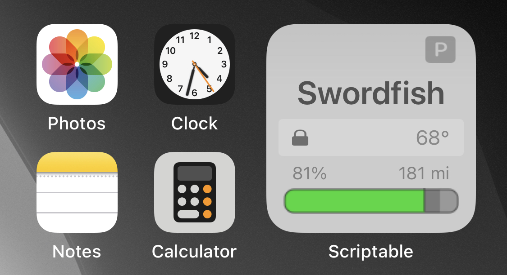

# TeslaFi-Widget
A Scriptable widget to pull data from the TeslaFi API

## Usage
You obviously need a TeslaFi account (and a Tesla). Get your [API Key](https://teslafi.com/api.php) and either add it as a widget parameter, or you can hardcode it in the js file.

There are a few options if you want to turn on/off battery percentage and estimated range (and if you'd like to use the car's range, or the TeslaFi estimate).

There's also an option for a 3D styled battery bar.

Note, due to the lag with TeslaFi pulling data from your car, and the lag of iOS pulling the data, the resulting display could be ~5 minutes stale.

Also note that this really only works as a small widget size, and only tested on an iPhone X (it may work fine for other phones, but not sure about iPad)

## Features

This should support charging info (icon, charge limit, and time until charge complete), conditioning on indicator, doors locked/unlocked, sentry mode on, as well as sleeping, idle, driving modes.

## Outstanding Bugs

There appears to be an issue with SF graphics in Scriptable where the images are stretched. 

## Changelog

v0.6 initial release added to GitHub
